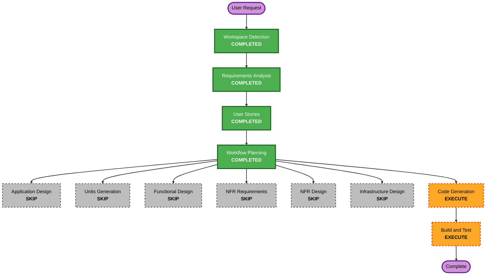

# Execution Plan

## Detailed Analysis Summary

### Transformation Scope

- **Transformation Type**: Application enhancement with a new user-facing tagging slice
- **Primary Changes**: Add personal-tag storage outside the companies index, introduce tag APIs, and support tag-name retrieval through `company_id` lookups against the existing companies index.
- **Related Components**: `app/models/`, `app/tags/`, `app/api/`, `app/search/`, `infra/opensearch/bootstrap/`, `tests/`, `docs/`, and `aidlc-docs/`

### Change Impact Assessment

- **User-facing changes**: Yes - users can create tags and retrieve companies by tag name.
- **Structural changes**: Yes - introduces a new tag-storage boundary and repository layer outside the canonical company schema.
- **Data model changes**: Yes - new tag-record schema and a separate tag index.
- **API changes**: Yes - adds `POST /api/tag/` and `GET /tag/{tagName}`.
- **NFR impact**: Low - reuses existing OpenSearch infrastructure and avoids hidden ranking changes.

### Risk Assessment

- **Risk Level**: Medium
- **Rollback Complexity**: Moderate
- **Testing Complexity**: Moderate

## Workflow Visualization

### Text Alternative

- Workspace Detection: completed
- Requirements Analysis: completed
- User Stories: completed
- Workflow Planning: completed
- Application Design: skip
- Units Generation: skip
- Functional Design: skip
- NFR Requirements: skip
- NFR Design: skip
- Infrastructure Design: skip
- Code Generation: execute next
- Build and Test: execute after code generation

## Phases to Execute

### 🔵 INCEPTION PHASE

- [x] Workspace Detection
- [x] Reverse Engineering - SKIP
  - **Rationale**: The repository is already understood well enough for this slice and no reverse-engineering refresh is needed.
- [x] Requirements Analysis
- [x] User Stories
- [x] Workflow Planning
- [x] Application Design - SKIP
  - **Rationale**: The requirements and approved story pack already define the needed component boundaries clearly enough: tag schema, tag repository, tag APIs, and company lookup through the existing search backend. A separate application-design stage would mostly restate decisions already locked.
- [x] Units Generation - SKIP
  - **Rationale**: Even though multiple files will change, this is still one coherent implementation slice centered on a single capability. Code-generation planning can sequence the work without a separate unit-decomposition stage.

### 🟢 CONSTRUCTION PHASE

- [x] Functional Design - SKIP
  - **Rationale**: The business rules are narrow and deterministic: normalize tags, store skinny tag records, and resolve company details by `company_id`.
- [x] NFR Requirements - SKIP
  - **Rationale**: Existing repo constraints are sufficient for this first tag slice, and the user explicitly chose a simple implementation without extra NFR expansion.
- [x] NFR Design - SKIP
  - **Rationale**: No separate NFR design work is needed once NFR requirements are skipped.
- [x] Infrastructure Design - SKIP
  - **Rationale**: The slice reuses the existing OpenSearch deployment and only needs an additional tag index artifact, not a new infrastructure pattern.
- [ ] Code Generation - EXECUTE
  - **Rationale**: Implementation is now clear enough to proceed directly into code-generation planning and then coding.
- [ ] Build and Test - EXECUTE
  - **Rationale**: The new tag model, repository, API routes, and search integration need focused verification before the slice can be considered complete.

## Recommended Implementation Shape

- Create a dedicated tag model under `app/models/tags.py`.
- Add a tag repository under `app/tags/repository.py` that reads and writes the separate tag index.
- Add tag endpoints in `app/api/` for tag creation and tag-name retrieval.
- Keep the tag index skinny and resolve full company details from the existing companies index through the current search service or a small lookup helper.
- Add a bootstrap artifact for the tag index or template under `infra/opensearch/bootstrap/` if needed.
- Add focused tests for normalization, repository behavior, API contracts, and tag-name retrieval.

## Extension Compliance Summary

- **Security baseline**: Not enabled for this slice by explicit requirements decision.
- **Property-based testing**: Not enabled for this slice by explicit requirements decision.
