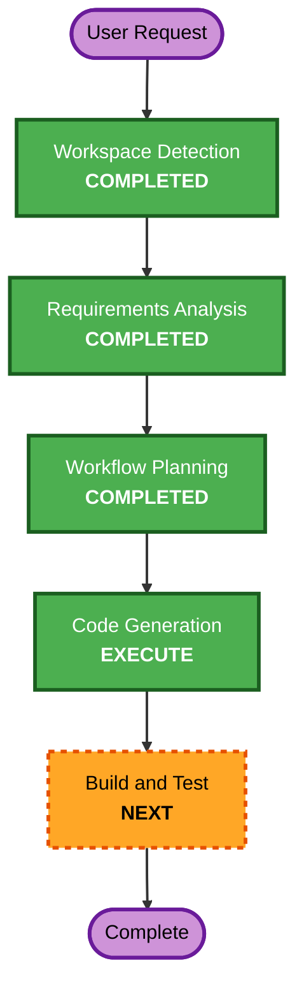

# Execution Plan

## Detailed Analysis Summary

### Transformation Scope

- **Transformation Type**: Greenfield repository bootstrap
- **Primary Changes**: Add repository skeleton directories and first local infrastructure compose slice
- **Related Components**: `infra/`, `aidlc-docs/`, future `app/`, `web/`, `docs/`, and `tests/`

### Change Impact Assessment

- **User-facing changes**: No
- **Structural changes**: Yes - establishes initial repository layout
- **Data model changes**: No
- **API changes**: No
- **NFR impact**: Low - local developer bootstrap only

### Risk Assessment

- **Risk Level**: Low
- **Rollback Complexity**: Easy
- **Testing Complexity**: Simple

## Workflow Visualization

### Text Alternative

- Workspace Detection: completed
- Requirements Analysis: completed
- Workflow Planning: completed
- Code Generation: execute now
- Build and Test: next

## Phases to Execute

### 🔵 INCEPTION PHASE

- [x] Workspace Detection
- [x] Reverse Engineering - SKIP
  - **Rationale**: No existing application code is present.
- [x] Requirements Analysis
- [x] User Stories - SKIP
  - **Rationale**: This is an internal repository bootstrap slice with no user workflow changes.
- [x] Workflow Planning
- [x] Application Design - SKIP
  - **Rationale**: No new service or component boundaries are being designed yet.
- [x] Units Generation - SKIP
  - **Rationale**: A single implementation slice is enough for this step.

### 🟢 CONSTRUCTION PHASE

- [x] Functional Design - SKIP
  - **Rationale**: No business logic is being introduced.
- [x] NFR Requirements - SKIP
  - **Rationale**: Local bootstrap only; no additional NFR analysis needed yet.
- [x] NFR Design - SKIP
  - **Rationale**: No NFR design changes follow from this slice.
- [x] Infrastructure Design - SKIP
  - **Rationale**: The requested output is already a direct infrastructure bootstrap artifact.
- [x] Code Generation - EXECUTE
  - **Rationale**: Files must be created to establish the initial repository and local stack.
- [ ] Build and Test - NEXT
  - **Rationale**: Validate compose shape after file generation.

## Extension Compliance Summary

- **Security baseline**: N/A for this slice because no full extension opt-in was requested and no application security controls are being modified.
- **Property-based testing**: N/A for this slice because no test logic is being introduced.
