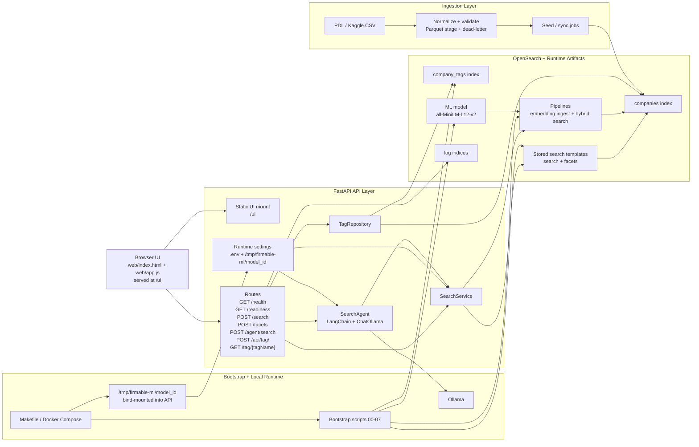
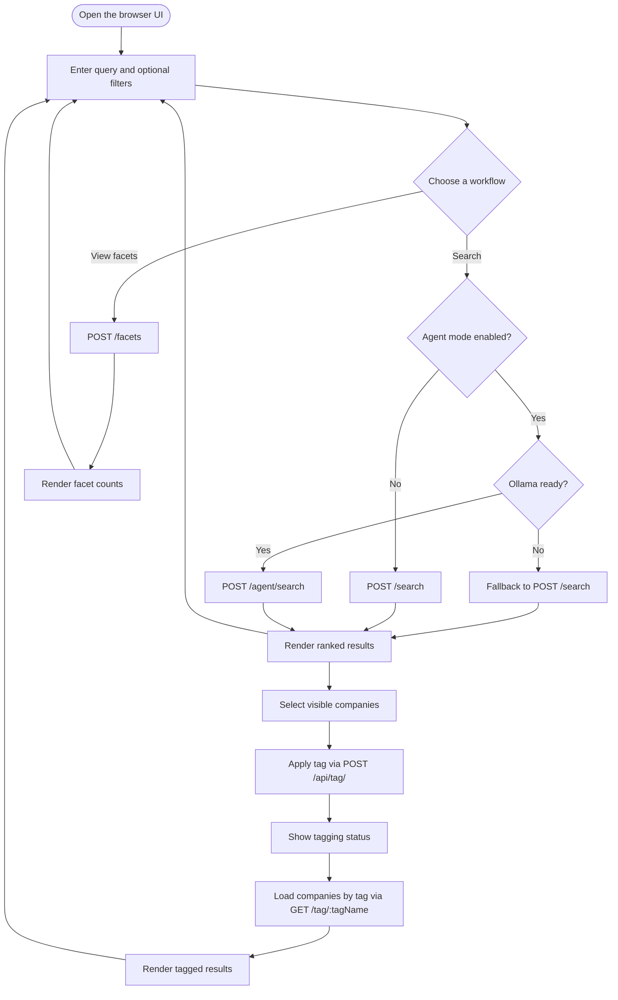
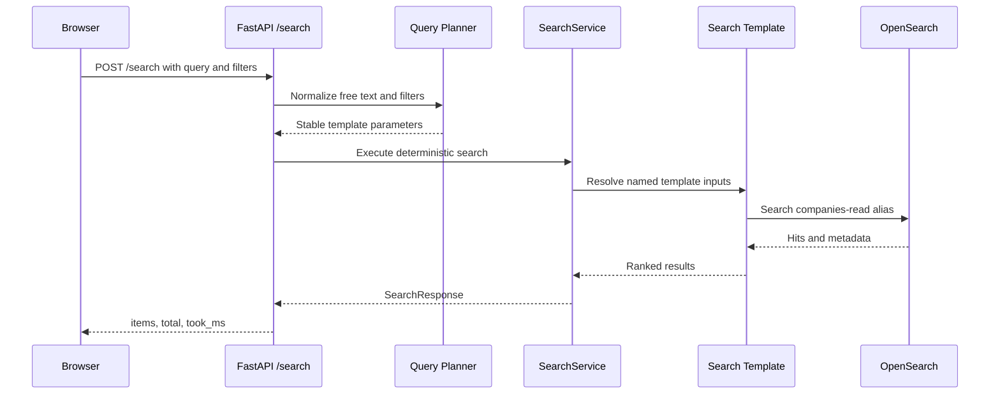
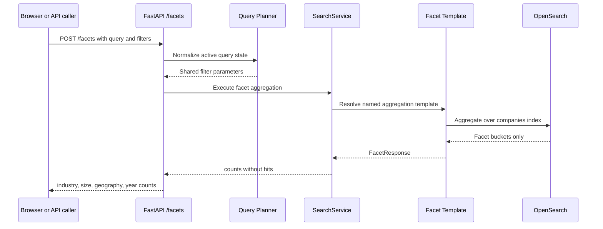
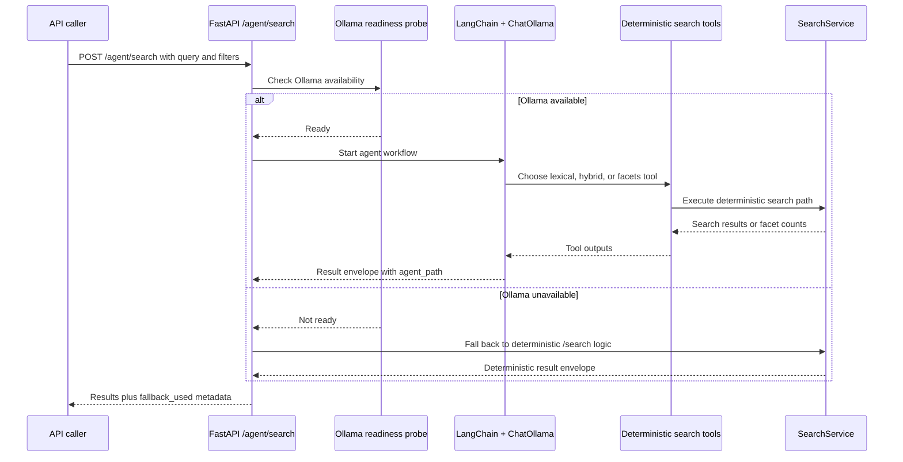
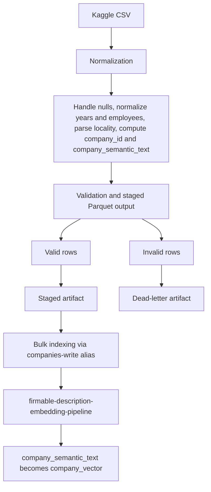

# Firmable Search System — Architecture

## Overview

Firmable is a staged company-search system over the People Data Labs company dataset. The delivered baseline is deterministic search first: the browser submits an explicit search request to the FastAPI service, the API normalizes free text plus filters into a stable search plan, and OpenSearch executes named search or aggregation templates using those normalized parameters.

The current repository now includes all six planned slices in runnable form: OpenSearch bootstrap, staged ingestion, deterministic search and facets, static UI, optional intelligent search through Ollama, and a separate Phase 6 tagging system. The optional agent lane is implemented on top of the deterministic search layer rather than replacing it.

Two rules keep the architecture aligned with the take-home scope and were preserved during live validation:

- The UI path must succeed without Ollama.
- OpenSearch query execution should use stored runtime templates created during bootstrap or API initialization rather than assembling ad hoc DSL bodies inside request handlers.

## Runtime Validation Snapshot

- Automated tests passed after the final runtime fixes: `361 passed, 15 deselected` for the non-integration suite and `15 passed` for the integration suite.
- Local deployment was verified through the repo's supported path: `make infra-up`, `make seed`, and live API/browser checks.
- The deterministic search surface is healthy: `POST /search`, `POST /facets`, `GET /health`, and `GET /readiness` all returned successful responses against the seeded `companies` index.
- The optional agent lane responded successfully through `POST /agent/search` after the ML model was deployed.
- The Phase 6 tag flow was verified end to end in the live browser: search, result selection, `POST /api/tag/`, `GET /tag/{tagName}`, and tag-backed result rendering all worked against the running stack.
- Two runtime fixes were required during validation: tolerating OpenSearch's `resource_already_exists_exception` during reseed, and mounting `/tmp/firmable-ml/model_id` into the API container so the hybrid search template always receives a non-empty `model_id`.

---

## End-to-End Architecture Diagram



## Component Map

- Browser clients use the same static UI for deterministic search, facets, and Phase 6 tagging.
- FastAPI serves both the static assets at `/ui` and the API routes used by the browser, automation, and optional agent clients.
- Search execution stays inside `SearchService`, which resolves runtime template parameters and delegates the actual query execution to OpenSearch.
- Tag writes and tag lookups stay inside a separate `TagRepository` backed by the `company_tags` index; company enrichment still comes from the canonical `companies` index.
- The agent lane is optional and wraps deterministic tools through LangChain plus ChatOllama rather than introducing a second independent search stack.
- Bootstrap scripts create the ML model, pipelines, templates, and tag index; the API consumes the live model id through the bind-mounted `/tmp/firmable-ml/model_id` state file.

---

## User Flow Diagram



## Request Flow

### Deterministic UI search (current baseline)



### Deterministic facets (current companion lane)



### Intelligent search (implemented optional lane)



### Ingestion flow



---

## Data Model

### Canonical company document

| Field                       | Type           | Notes                                                          |
| --------------------------- | -------------- | -------------------------------------------------------------- |
| `company_id`                | keyword        | deterministic SHA-256 digest of source id plus normalized name |
| `name`                      | text + keyword | full-text search plus exact match support                      |
| `domain`                    | keyword        | exact filter and exact-match boost                             |
| `industry`                  | text + keyword | synonym-aware text field plus exact facet field                |
| `size_range`                | keyword        | faceting and filtering                                         |
| `city`                      | keyword        | normalized from locality parsing                               |
| `region`                    | keyword        | normalized from locality parsing                               |
| `country`                   | keyword        | normalized country                                             |
| `year_founded`              | integer        | optional, omitted when unavailable                             |
| `current_employee_estimate` | integer        | current company size signal                                    |
| `total_employee_estimate`   | integer        | broader company size signal                                    |
| `linkedin_url`              | keyword        | exact value storage                                            |
| `company_semantic_text`     | text           | deterministic embedding source text                            |
| `company_vector`            | knn_vector     | 384-dimensional vector populated by ingest pipeline            |

### Tagging status

Tags remain intentionally outside the base company schema and the companies index. The Phase 6 implementation uses a separate OpenSearch tag index with skinny records containing normalized tag value, display tag value, `company_id`, `user_id`, and timestamps. Full company details for tag retrieval are resolved from the existing companies index by `company_id`, so the tag index never stores duplicate company payloads.

### Tagging UI flow

The static browser UI keeps tagging explicit and local to the results panel:

- The user runs the normal company search flow first.
- Each visible result card exposes a selection checkbox.
- A tag action bar lets the user enter one tag name and apply it across the selected companies.
- The frontend sends one `POST /api/tag/` request per selected `company_id`, which keeps the backend contract simple and avoids a batch-write endpoint in the first slice.
- A second control in the same panel allows the user to load companies for a given tag through `GET /tag/{tagName}` and render them back into the existing result list.
- This slice is intentionally limited to current-page selection, no autocomplete, no saved tag suggestions, and no hidden influence on `/search` ranking.

### Manual smoke path for tagging UI

1. Open the UI at `/ui` from the running API service.
2. Run a normal company search and confirm the result cards render with selection checkboxes.
3. Select one or more visible companies, enter a tag in the "Tag Selected Companies" panel, and apply it.
4. Confirm the UI shows success or partial-failure feedback without leaving the results view.
5. Enter the same tag in "Load Companies By Tag" and confirm the tagged companies render back into the existing result list.
6. Confirm the normal `/search` flow still returns standard results when a tag lookup is not being used.

---

## Search Lanes and Latency Budgets

| Lane                    | Path                                                   | Ollama dependency | Target p99 |
| ----------------------- | ------------------------------------------------------ | ----------------- | ---------- |
| UI search               | POST /search → deterministic planner → stored template | None              | < 200 ms   |
| UI facets               | POST /facets → deterministic planner → stored template | None              | < 100 ms   |
| Agent search (primary)  | POST /agent/search → LangChain + ChatOllama → tools    | Required          | < 3 s      |
| Agent search (fallback) | POST /agent/search → deterministic planner → template  | None              | < 200 ms   |

---

## API Surface

| Endpoint             | Status                       | Purpose                                             |
| -------------------- | ---------------------------- | --------------------------------------------------- |
| `GET /health`        | implemented and validated    | process liveness                                    |
| `GET /readiness`     | implemented and validated    | OpenSearch readiness and companies-index presence   |
| `POST /search`       | implemented and validated    | deterministic hybrid or lexical search lane         |
| `POST /facets`       | implemented and validated    | deterministic facet lane                            |
| `POST /agent/search` | implemented and smoke-tested | intelligent search wrapper over deterministic tools |
| `POST /api/tag/`     | implemented and validated    | create or upsert a personal tag for one company     |
| `GET /tag/{tagName}` | implemented and validated    | resolve tagged companies by lookup plus enrichment  |

All search endpoints share the same response envelope:

```json
{
  "items": [
    {
      "company_id": "...",
      "name": "...",
      "score": 12.34,
      "match_reasons": ["name_match", "industry_synonym"]
    }
  ],
  "total": 1247,
  "page": 1,
  "page_size": 20,
  "took_ms": 42
}
```

If `/agent/search` is added in Phase 5, it should extend the same response shape with two observable fields:

```json
{ "agent_path": true, "fallback_used": false }
```

### Pagination strategy

The current API contract uses page-number pagination via `page` and `page_size`, which the deterministic search path should translate to OpenSearch `from` and `size`.

This is an intentional take-home tradeoff, not a production pagination design:

- `from` + `size` keeps the API and browser UI simple and matches the existing request schema.
- It is suitable for shallow browsing of result sets and straightforward numbered pagination.
- It is not suitable for deep pagination across thousands of hits because offset cost grows with page depth and page contents can drift while the index changes.
- The production upgrade path is Point in Time plus `search_after`, which would require a cursor-style API instead of relying only on page numbers.

For this repository, treat `from` + `size` as a demo-safe default and document it as a non-production limitation alongside search scalability notes.

---

## Infrastructure Topology

### Local (Docker Compose)

```
┌──────────────────────────────────────────────────────────────────┐
│  Docker network: firmable                                        │
│                                                                  │
│  opensearch        :9200/:9300   (custom image, ML Commons)      │
│  opensearch-dash   :5601         (dev visibility only)           │
│  ollama            :11434        (ollama/ollama, named volume)   │
│  api               :8000         (FastAPI + static /ui mount)    │
│                                                                  │
│  Volumes:  opensearch-data, ollama-models, /tmp/firmable-ml      │
└──────────────────────────────────────────────────────────────────┘
```

### Production (target topology)

```
┌──────────────────────────────────────────────────────────────────┐
│  OpenSearch cluster                                              │
│  ├─ data nodes (n ≥ 3, shards + replicas)                        │
│  └─ ML nodes   (dedicated, GPU optional)                         │
│                                                                  │
│  API service   (horizontally scaled, load balanced)              │
│                                                                  │
│  Optional LLM lane                                                │
│  ─ Ollama-compatible local runtime or hosted model provider       │
│  ─ only required for /agent/search                               │
│  ─ deterministic /search and /facets stay independent            │
│                                                                  │
│  Observability (structured logs, metrics, LangSmith traces)      │
└──────────────────────────────────────────────────────────────────┘
```

---

## Bootstrap Sequence

```
make infra-up
  ├─ docker compose up -d --build (opensearch, dashboards, ollama, api)
  ├─ 01-register-model.sh           register model group + embedding model
  ├─ 02-deploy-model.sh             deploy model and persist /tmp/firmable-ml/model_id
  ├─ 03-create-pipelines.sh         apply ingest pipeline, search pipeline, and index template
  ├─ 04-create-search-templates.sh  install named search and facets templates
  ├─ 07-create-tag-index.sh         create company_tags index
  ├─ 05-create-log-templates.sh     install observability index templates
  └─ 06-write-model-env.sh          persist EMBEDDING_MODEL_ID into .env for non-container runs

make seed CSV=data/sample.csv
  └─ runs app/ingestion/seed.py against the companies index using config/ingestion.toml
```

The API startup path also verifies the named search templates on boot. For containerized runs, the API now reads the deployed model id through the bind-mounted `/tmp/firmable-ml/model_id` file so the hybrid search template never receives an empty `model_id` when bootstrap runs after container creation.

---

## Observability

| Signal                    | What is measured                                        |
| ------------------------- | ------------------------------------------------------- |
| Structured logs           | request id, endpoint, latency, status                   |
| Request counters          | per-endpoint request and error counts                   |
| Search outcome counters   | total results, zero-result rate                         |
| OpenSearch query timings  | `took` field forwarded as metric                        |
| Ollama reachability       | probe result logged for the optional /agent/search lane |
| Agent tool call counts    | tool name + invocation count per intelligent request    |
| Fallback activation count | times deterministic search is used instead of agent     |
| ML ingest failures        | text_embedding processor error counts                   |
| LangSmith traces          | enabled via `LANGSMITH_TRACING=true` (off by default)   |

---

## Key Architectural Decisions

| Decision                                                     | Rationale                                                                                |
| ------------------------------------------------------------ | ---------------------------------------------------------------------------------------- |
| Deterministic search is the primary product path             | the take-home must work without Ollama and remain easy to explain                        |
| Stored OpenSearch templates own query execution              | keeps ranking and aggregation logic versionable and outside ad hoc handler code          |
| `company_semantic_text` is the main semantic text field      | supports hybrid retrieval and intent matching from normalized attributes                 |
| `company_id` is a deterministic hash, not a raw source id    | stable identity survives normalization and avoids trusting raw source identifiers alone  |
| Exact boosts stay available for company name and domain      | precise company lookups must not degrade under semantic search plans                     |
| OpenSearch ML Commons handles embeddings locally             | avoids an external embedding dependency for the core search stack                        |
| Staged Parquet artifacts remain part of ingestion            | keeps ingestion replayable, auditable, and easier to debug                               |
| UI search is explicit-submit only                            | aligns with the current browser implementation and keeps request volume predictable      |
| LangChain + ChatOllama is the recommended Phase 5 agent path | lower delivery risk than direct Ollama orchestration or OpenSearch-native agentic search |
| Tag storage uses a separate skinny OpenSearch index          | keeps tag writes and lookup independent from the canonical company documents             |

---

## Repository Map

### Current repository surfaces

```
firmable/
├── app/
│   ├── settings.py                   runtime config
│   ├── api/
│   │   ├── main.py                   FastAPI app, /ui, /health, /readiness, /search, /facets, /agent/search
│   │   └── schemas.py                request and response models
│   ├── ingestion/
│   │   ├── identity.py               company_id and company_semantic_text builders
│   │   ├── normalize.py              CSV cleanup and normalization
│   │   ├── seed.py                   bulk seed path
│   │   └── sync.py                   incremental sync path
│   ├── models/company.py             canonical company schema helpers
│   ├── tags/repository.py            OpenSearch-backed tag storage and lookup
│   └── search/
│       ├── service.py                SearchService and company document lookup
│       ├── index_template.json       strict mappings and analyzers
│       └── synonyms.txt              industry synonym rules
├── infra/
│   ├── docker-compose.yml            local OpenSearch, Dashboards, Ollama, API
│   ├── ollama/pull-model.sh          optional agent-model bootstrap
│   └── opensearch/bootstrap/         model, pipeline, and template bootstrap scripts
├── web/
│   ├── index.html                    static UI shell, filters, and tagging controls
│   └── app.js                        explicit-submit browser logic and Phase 6 tag flow
├── tests/                            ingestion and API-adjacent tests
└── docs/architecture.md              this file
```

### Planned additions for upcoming phases

- Suggestions and richer tag discovery remain deferred beyond the current Phase 6 slice.
- Production deployment packaging, deeper observability dashboards, and scale-out hardening remain future work beyond the local validated stack.

---

## Deferred Decisions

- The Phase 6 browser flow supports result-card selection, per-company tag writes, and tag-name retrieval from the same results panel without introducing a frontend framework.
- The intelligent-search lane remains optional. For this take-home, the recommended path is LangChain plus ChatOllama over deterministic tools. Direct Ollama orchestration is feasible but more brittle, and OpenSearch-native agentic search is not worth the upgrade risk.
